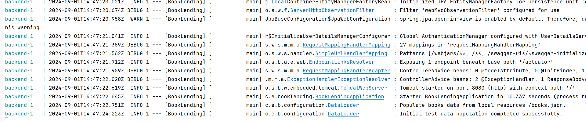
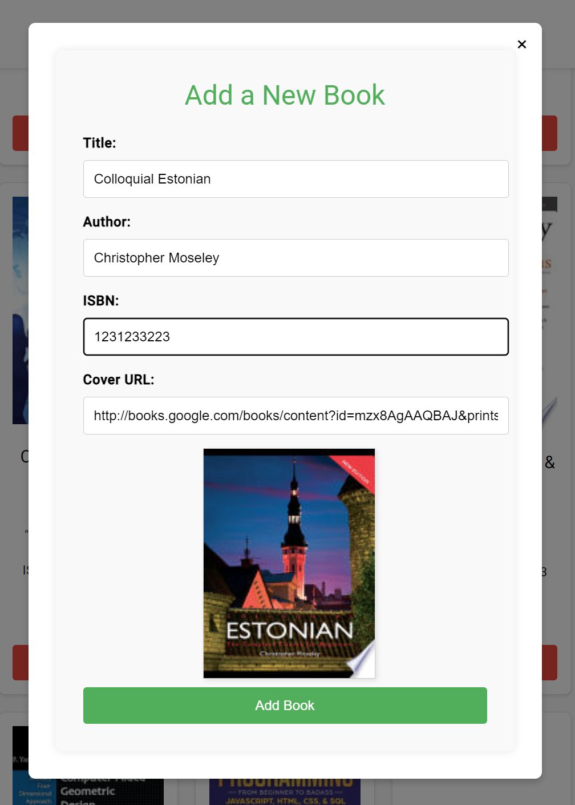
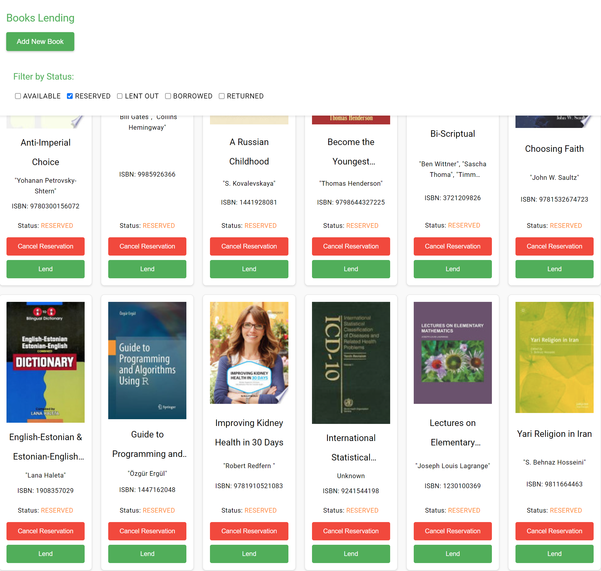

# Quick guide

1. [Clone the repository](#clone-the-repository)
2. [Start BookLending application using docker compose](#start-booklending-application-using-docker-compose)
3. [Start using BookLending application](#start-using-booklending-application)
4. [Librarian role view](#librarian-role-view)
5. [Borrower role view](#borrower-role-view)

<a id="clone-the-repository"></a>
### 1. Clone the repository


Run the following command:

 ```bash
git clone https://github.com/rutar/BookLending.git
cd BookLending
 ```
<a id="start-booklending-application-using-docker-compose"></a>
### 2. Start BookLending application using docker compose

Ensure Docker and Docker-compose are installed:

 ```bash
docker --version
docker-compose --version
 ```

Ensure gradle wrapper is available:
 ```bash
gradlew wrapper
 ```

Start the services defined in docker-compose.yml, ensuring to build images:
 ```bash
docker-compose up --build
 ```
Three container images will be built: **backend**, **frontend** and **postgres**.

Successful run of BookLending application will be shown in logs:



<a id="start-using-booklending-application"></a>
### 3. Start using BookLending application

Initially two roles and users are stored and possible to use:

Librarian (Admin) and User.


Navigate to localhost:


<a id="librarian-role-view"></a>
### 4. Librarian role view

Enter librarian credentials, by default:


username:**admin**

password: **adminpass**


Librarian view consists of sticky header with 'Add New Book' button, book status filters
and scrollable grid of book-cards with implemented infinite scrolling.

Each book-card have basic book information (title, author, ISBN), book status field and
action buttons, if actions available.

Book statuses and actions flow are described in corresponded topic.

Librarian can add a new book, by pressing "Add New Book" button:


All fields should be filled up, there is a validation process if  input data is incorrect.


After correct filling up the data, 'Add Book' button becomes active, and it is possible to save new book in database.




If saving was successful, success notification will be shown:


If no, then error message will be shown:


Status filtering bar helps user to filter books with specific statuses.
For example to lend books out - it is needed to see what books are reserved:




Then librarian can cancel reservation or lend a book.

If book is 'lent out' or 'borrowed' there are no any buttons,
but only book statuses at the book card:


'Lent out' status means, that reserved book is lent out to borrower,
but borrower should also accept book receiving. After that books becomes in borrowed state.
With books in 'borrowed' state there are no actions to librarian, just wait until book is returned.

When user returns a book it becomes in 'returned' status, and librarian should accept
that book is received by library:


After that book becomes in 'available' status.

<a id="borrower-role-view"></a>
### 5. Borrower role view

Navigate to localhost.
Enter borrower credentials, by default:


username:**user**

password: **userpass**


Borrower view contains a sticky header with search panel, and book-cards grid with
implemented infinite scrolling.

Books are searchable by title, author and ISBN. Search is performed while typing symbols
to search panel:


Borrower can reserve a book and cancel reservation.
If reserved book is lent out by librarian it will become into 'lent out' state
and could be received by borrower:


After receiving book becomes to 'borrowed' state. After returning book back to library, borrower
will mark book as returned. Librarian should accept this on his view.


# Book Lending Application Documentation

## Table of Contents
1. [Introduction](#introduction)
2. [Technical Stack](#technical-stack)
3. [System Architecture](#system-architecture)
4. [Backend](#backend)
    - [API Endpoints](#api-endpoints)
    - [Controllers](#controllers)
    - [Services](#services)
    - [Models](#models)
    - [Swagger docs](#swagger-docs)
5. [Frontend](#frontend)
    - [Components](#components)
    - [Services](#frontend-services)
6. [Database](#database)
7. [Authentication and Authorization](#authentication-and-authorization)
8. [Testing](#testing)
9. [Deployment](#deployment)
10. [Future Enhancements](#future-enhancements)
11. [Flow description](#flow-descriprion)

<a id="introduction"></a>
## 1. Introduction

The Book Lending Application is a crowdsourced platform that allows users to borrow and lend books. It provides a user-friendly interface for managing book reservations, borrowing, and returning processes.

### Key Features:
- User registration and authentication
- Book search functionality
- Book reservation and cancellation
- Marking books as received and returned
- Adding and removing books for lending (for book owners)
- Role-based access control (User and Admin roles)
<a id="technical-stack"></a>
## 2. Technical Stack

- **Backend:** Java 17+, Spring Boot
- **Frontend:** Angular
- **Database:** PostgreSQL
- **API Documentation:** Swagger (OpenAPI specification)
- **Containerization:** Docker
<a id="system-architecture"></a>
## 3. System Architecture

The application follows a typical client-server architecture:

1. **Client (Frontend):** Angular-based single-page application (SPA)
2. **Server (Backend):** Spring Boot REST API
3. **Database:** PostgreSQL for data persistence
<a id="backend"></a>
## 4. Backend

### API Endpoints

The backend exposes RESTful API endpoints for various functionalities. Here's an overview of the main endpoints:

- `/api/auth`: Authentication endpoints
- `/api/users`: User management endpoints
- `/api/books`: Book management endpoints
- `/api/actions`: Book lending action endpoints (reserve, cancel, etc.)

Detailed API documentation is available through Swagger UI at `/swagger-ui.html` when running the application.

### Controllers

The application uses several controllers to handle different aspects of the system:

1. **AuthController:** Handles user authentication
2. **UserController:** Manages user-related operations
3. **BookController:** Handles book-related operations
4. **ActionController:** Manages book lending actions

Example of AuthController:

```java
@RestController
@RequestMapping("/api/auth")
@RequiredArgsConstructor
public class AuthController {
    private final AuthService authService;

    @PostMapping("/login")
    public String login(@RequestBody AuthRequest authRequest) {
        return authService.authenticateAndGenerateToken(
            authRequest.getUsername(), 
            authRequest.getPassword()
        );
    }
}
```

### Services

Services contain the business logic of the application. Key services include:

- **AuthService:** Handles user authentication and token generation
- **UserService:** Manages user-related operations
- **BookService:** Handles book-related operations
- **ActionService:** Manages book lending actions

### Models

The main domain models include:

- **User:** Represents a user in the system
- **Book:** Represents a book in the lending library
- **Action:** Represents a lending action (e.g., reservation, return)
<a id="#swagger-docs"></a>
### Swagger docs

The Swagger documentation will be automatically generated by Spring Boot if you've configured it correctly. To access it:
Visit http://localhost:8080/swagger-ui.html after the backend service is running.
<a id="frontend"></a>
## 5. Frontend

The frontend is built with Angular and consists of several components and services.

### Components

1. **LoginComponent:** Handles user authentication
2. **DashboardComponent:** Admin dashboard for managing books
3. **HomeComponent:** User home page for borrowing books
4. **AddBookComponent:** Form for adding new books
5. **ConfirmationModalComponent:** Reusable confirmation modal

Example of LoginComponent:

```typescript
@Component({
  selector: 'app-login',
  standalone: true,
  imports: [CommonModule, FormsModule],
  templateUrl: './login.component.html',
  styleUrls: ['./login.component.scss'],
})
export class LoginComponent {
  username: string = '';
  password: string = '';

  constructor(
    private authService: AuthService,
    private router: Router,
    private notificationService: NotificationService
  ) {}

  login() {
    this.authService.login(this.username, this.password).subscribe(
      (token: string) => {
        this.authService.saveToken(token);
        const roleName = this.authService.getRoleNameFromToken();
        // Navigate based on user role
        // ...
      },
      (error) => {
        this.notificationService.openDialog('Invalid username or password.', true);
      }
    );
  }
}
```

### Frontend Services

1. **AuthService:** Handles authentication-related operations
2. **BookService:** Manages book-related API calls
3. **NotificationService:** Provides a centralized way to display notifications
<a id="database"></a>
## 6. Database

The application uses PostgreSQL as its primary database. Key tables include:

- `users`: Stores user information
- `books`: Stores book information
- `actions`: Stores lending actions
<a id="authentication-and-authorization"></a>
## 7. Authentication and Authorization

Initially provisioned two users:

- ### Administrator or librarian:
  username: **admin**  password: **adminpass**

- ### User, that borrows books:
   username: **user**  password: **userpass**

The application uses JWT (JSON Web Tokens) for authentication. The process works as follows:

1. User logs in with username and password
2. Server validates credentials and generates a JWT
3. Client stores the JWT and includes it in the Authorization header for subsequent requests
4. Server validates the JWT for protected endpoints
5. Passwords are encrypted

Role-based access control is implemented to distinguish between regular users and administrators.


<a id="testing"></a>
## 8. Testing

The application includes unit tests and integration tests for both backend and frontend components. Tests are written using JUnit for the backend and Jasmine/Karma for the frontend.
<a id="technical-stack"></a>
## 9. Deployment

The application is containerized using Docker, allowing for easy deployment and scaling. A `docker-compose.yml` file is provided to orchestrate the deployment of the backend, frontend, and database services.
<a id="future-enhancements"></a>
## 10. Future Enhancements

Potential areas for future development include:

- Implementing a rating system for borrowers and lenders
- Adding a notification system for due dates and available books
- Integrating with external book databases for richer book information
- Implementing a recommendation system based on user preferences and borrowing history

This documentation provides an overview of the Book Lending Application. For more detailed information on specific components or processes, please refer to the inline code documentation and comments.
<a id="flow-description"></a>
## 11. Flow description

### Flow chart diagram

[ Flow chart diagram (click)](https://mermaid.live/edit#pako:eNqNk0FrgzAUgP_KI6dttAx29DCwNQeZU3C2O8xR0vrUME1KjBul7L8vNbVu4qA5yIv53peXF3IkO5khcUijmUaPs0Kxev75kAow4-3uHebzR3DXrh-4i4A64HreZhFFT3Djes9-eGvBC9DhMX2h8Zp6Th-dM1Zmck7okbF-6YZLGnT8xjJu4kehzb3_veUfQ0DDZBOtEucSTRTZL3UZiyiOo1db45L6UzX2yPlMySoOLX-Kpo5kifGR_vr_75pptgMeDWgyZi0tpEZQvCg1yHzItYun4QuuOaugu0r7G0XW5U07-hYOioWUH8Ab0FjvpWKKVwcoscoglwoYtA2qa8R9p0fikjWwRRRQ8E_zla2G7QFYVnNxjbW_j8G6MvV0VoU7NM4MdImwNXtdd3x7YZM-3SrxyzcboC9m2iwK25JT7aAl7JXcYdOMtyUzUqOqGc_MEzueVlNilDWmxDFhhjlrK52SVHwblLVavhzEjjhatTgjSrZFSZycVY2ZtftseKIW-f4BnnkcCg)

1. Book Statuses:
- AVAILABLE
- RESERVED
- LENT_OUT
- BORROWED
- RETURNED

2. User Types:
- ADMIN (librarian)  username: **admin**  password: **adminpass**

- USER (borrower)  username: **user**  password: **userpass**

3. Actions:
- RESERVE_BOOK
- CANCEL_BOOK_RESERVATION
- LENT_OUT_BOOK
- RECEIVE_BOOK
- RETURN_BOOK
- ADD_BOOK
- DELETE_BOOK

4. Flow Description:
- Initial book state is AVAILABLE
- AVAILABLE books can be RESERVED by USER, changing status to RESERVED
- RESERVED books can be:
   * CANCEL_BOOK_RESERVATION by both USER and ADMIN, returning to AVAILABLE
   * LENT_OUT_BOOK by ADMIN, changing status to LENT_OUT
- LENT_OUT books can be RECEIVE_BOOK by USER, changing status to BORROWED
- BORROWED books can be RETURN_BOOK by USER, changing status to RETURNED
- RETURNED books can be RECEIVE_BOOK by ADMIN, changing status back to AVAILABLE
- ADMIN can ADD_BOOK (creating a new AVAILABLE book) or DELETE_BOOK (removing an AVAILABLE book from the system)

The action diagram visualizes this flow, showing how the book moves between different statuses based on the actions taken by ADMIN and USER.

Additional observations:
1. The flow ensures that books go through a proper lifecycle, from being available, to reserved, lent out, borrowed, returned, and then back to available.
2. There's a clear distinction between ADMIN and USER actions, maintaining control over the lending process.
3. The LENT_OUT and BORROWED states help track whether the book has been physically handed over to the user.
4. The RETURNED state allows for a final check by the ADMIN before the book becomes available again.

Potential improvements or considerations:
1. You might want to consider adding a LOST or DAMAGED state to handle cases where books are not returned or are returned in poor condition.
2. An OVERDUE state could be useful for books that haven't been returned by their due date.
3. You could add a MAINTENANCE or REPAIR state for books that need to be temporarily removed from circulation.
4. Consider adding a time limit for the RESERVED state to prevent books from being indefinitely held without being borrowed.

