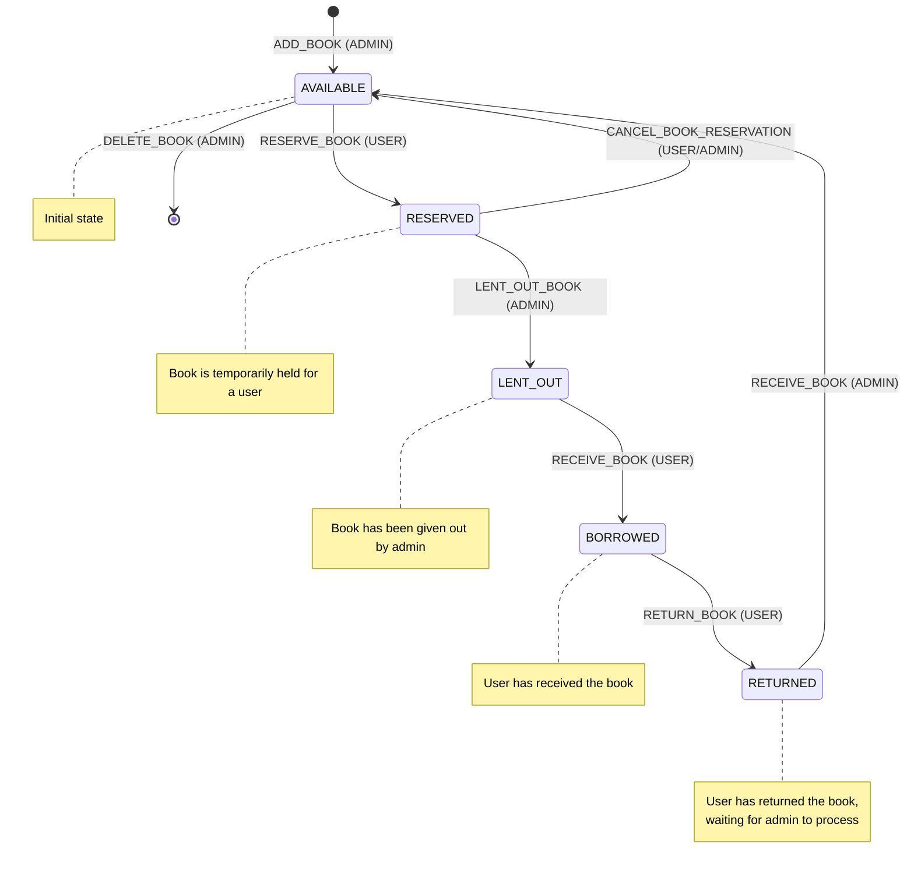

# BooklendingFrontend

This project was generated with [Angular CLI](https://github.com/angular/angular-cli) version 18.2.0.

## Development server

Run `ng serve` for a dev server. Navigate to `http://localhost:4200/`. The application will automatically reload if you change any of the source files.

## Code scaffolding

Run `ng generate component component-name` to generate a new component. You can also use `ng generate directive|pipe|service|class|guard|interface|enum|module`.

## Build

Run `ng build` to build the project. The build artifacts will be stored in the `dist/` directory.

## Running unit tests

Run `ng test` to execute the unit tests via [Karma](https://karma-runner.github.io).

## Running end-to-end tests

Run `ng e2e` to execute the end-to-end tests via a platform of your choice. To use this command, you need to first add a package that implements end-to-end testing capabilities.

## Further help

To get more help on the Angular CLI use `ng help` or go check out the [Angular CLI Overview and Command Reference](https://angular.dev/tools/cli) page.

## Flow chart diagram

[Flow chart diagram](https://mermaid.live/edit#pako:eNqNk0FrgzAUgP_KI6dttAx29DCwNQeZU3C2O8xR0vrUME1KjBul7L8vNbVu4qA5yIv53peXF3IkO5khcUijmUaPs0Kxev75kAow4-3uHebzR3DXrh-4i4A64HreZhFFT3Djes9-eGvBC9DhMX2h8Zp6Th-dM1Zmck7okbF-6YZLGnT8xjJu4kehzb3_veUfQ0DDZBOtEucSTRTZL3UZiyiOo1db45L6UzX2yPlMySoOLX-Kpo5kifGR_vr_75pptgMeDWgyZi0tpEZQvCg1yHzItYun4QuuOaugu0r7G0XW5U07-hYOioWUH8Ab0FjvpWKKVwcoscoglwoYtA2qa8R9p0fikjWwRRRQ8E_zla2G7QFYVnNxjbW_j8G6MvV0VoU7NM4MdImwNXtdd3x7YZM-3SrxyzcboC9m2iwK25JT7aAl7JXcYdOMtyUzUqOqGc_MEzueVlNilDWmxDFhhjlrK52SVHwblLVavhzEjjhatTgjSrZFSZycVY2ZtftseKIW-f4BnnkcCg)

1. Book Statuses:
  - AVAILABLE
  - RESERVED
  - LENT_OUT
  - BORROWED
  - RETURNED

2. User Types:
  - ADMIN (librarian)
  - USER (borrower)

3. Actions:
  - RESERVE_BOOK
  - CANCEL_BOOK_RESERVATION
  - LENT_OUT_BOOK
  - RECEIVE_BOOK
  - RETURN_BOOK
  - ADD_BOOK
  - DELETE_BOOK

4. Flow Description:
  - Initial book state is AVAILABLE
  - AVAILABLE books can be RESERVED by USER, changing status to RESERVED
  - RESERVED books can be:
    * CANCEL_BOOK_RESERVATION by both USER and ADMIN, returning to AVAILABLE
    * LENT_OUT_BOOK by ADMIN, changing status to LENT_OUT
  - LENT_OUT books can be RECEIVE_BOOK by USER, changing status to BORROWED
  - BORROWED books can be RETURN_BOOK by USER, changing status to RETURNED
  - RETURNED books can be RECEIVE_BOOK by ADMIN, changing status back to AVAILABLE
  - ADMIN can ADD_BOOK (creating a new AVAILABLE book) or DELETE_BOOK (removing an AVAILABLE book from the system)

The action diagram visualizes this flow, showing how the book moves between different statuses based on the actions taken by ADMIN and USER.

Additional observations:
1. The flow ensures that books go through a proper lifecycle, from being available, to reserved, lent out, borrowed, returned, and then back to available.
2. There's a clear distinction between ADMIN and USER actions, maintaining control over the lending process.
3. The LENT_OUT and BORROWED states help track whether the book has been physically handed over to the user.
4. The RETURNED state allows for a final check by the ADMIN before the book becomes available again.

Potential improvements or considerations:
1. You might want to consider adding a LOST or DAMAGED state to handle cases where books are not returned or are returned in poor condition.
2. An OVERDUE state could be useful for books that haven't been returned by their due date.
3. You could add a MAINTENANCE or REPAIR state for books that need to be temporarily removed from circulation.
4. Consider adding a time limit for the RESERVED state to prevent books from being indefinitely held without being borrowed.
